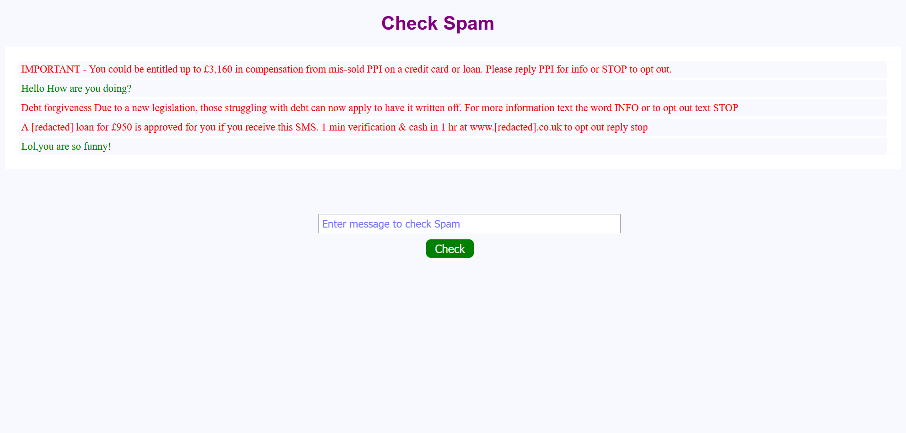

### This app classifies spam messages given as an input from the user.The classification is done by a ML model using Naive Bayes Algorithm.

## Demo
All the entered messages are classified as Spam(denoted by red) or non-spam(denoted by green).
